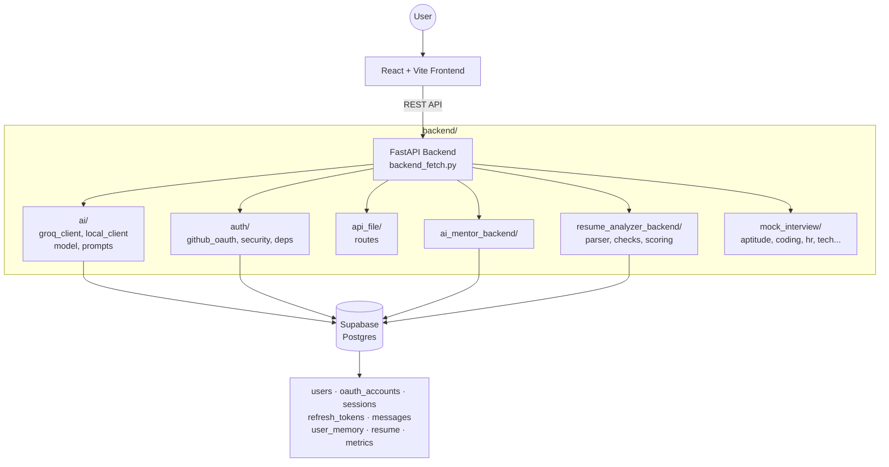

<p align="center">
  
</p>

# Interview Prep


This project is under active development. Core modules (AI Mentor, Resume Analyzer, Authentication) are working; others are in progress — see [Status](#status) below.

An AI-powered interview preparation platform combining a local/cloud LLM mentor, resume analysis, and mock interviews into one application.

---

## Table of Contents

- [Overview](#overview)
- [Status](#status)
- [Architecture](#architecture)
- [Tech Stack](#tech-stack)
- [Getting Started](#getting-started)
- [Project Structure](#project-structure)
- [Contributing](#contributing)
- [License](#license)

---


## Overview

Interview Prep helps candidates practice for technical interviews through an AI mentor, resume scoring, and (soon) simulated mock interviews — rather than a static bank of questions. The backend is modular: separate services for AI inference, authentication, and resume analysis, all backed by Supabase.

---


## Status

| Feature | Status |
|---|---|
| AI Mentor (Groq + local LLM via LM Studio) |  |
| Resume Analyzer (ATS checks + scoring) |  |
| Authentication (email/password + GitHub OAuth) |  |
| Supabase database (schema + summaries) |  |
| Mock Interview simulator |  |
| Dashboard & analytics |  |
| Progress tracking |  |

---


## Architecture



The `ai/` module supports two interchangeable clients — a hosted Groq client and a local client via LM Studio — so inference can run cloud-side or fully offline.

---


## Tech Stack

| Layer | Tools |
|---|---|
| Frontend | React, Tailwind CSS |
| Backend | FastAPI, Python |
| Database | Supabase (Postgres) |
| AI | Groq API, Local LLMs (LM Studio) |
| Auth | GitHub OAuth, session + refresh tokens |

---


## Getting Started

### Prerequisites
- Python 3.11+
- Node.js 18+
- A Supabase project (URL + anon/service key)
- A Groq API key, and/or LM Studio running locally for offline inference

### Clone

```bash
git clone https://github.com/Dinpikha/Interview-prep.git
cd Interview-prep
```

### Backend

```bash
python -m venv venv
source venv/bin/activate      # Windows: venv\Scripts\activate
pip install -r backend/requirements.txt
```

Create a `.env` file in `backend/`:

```env
SUPABASE_URL=your_supabase_url
SUPABASE_KEY=your_supabase_key
GROQ_API_KEY=your_groq_api_key
GITHUB_CLIENT_ID=your_github_client_id
GITHUB_CLIENT_SECRET=your_github_client_secret
```

```bash
uvicorn backend.backend_fetch:app --reload
```

### Frontend

```bash
cd interview-prep-app
npm install
npm run dev
```

> Confirm the exact `.env` variable names once the config is finalized — these are placeholders based on the current module layout.

---


## Project Structure

```
.
├── backend
│   ├── ai
│   │   ├── groq_client.py
│   │   ├── local_client.py
│   │   ├── model.py
│   │   └── prompts.py
│   ├── ai_mentor_backend
│   │   ├── check_if_related.py
│   │   ├── connecting_files_logic.py
│   │   ├── generate_new_summary.py
│   │   ├── get_embeddings.py
│   │   └── get_response_from_model.py
│   ├── api_file
│   │   ├── auth_route_api_file.py
│   │   ├── create_session_api_file.py
│   │   ├── delete_user_api_file.py
│   │   ├── model_response_api_file.py
│   │   ├── resume_analyzer_api_file.py
│   │   └── return_summary_api_file.py
│   ├── auth
│   │   ├── deps.py
│   │   ├── github_oauth.py
│   │   └── security.py
│   ├── mock_interview
│   │   ├── aptitude.py
│   │   ├── coding.py
│   │   ├── hr.py
│   │   ├── resume_based.py
│   │   ├── role_specific.py
│   │   └── tech.py
│   ├── resume_analyzer_backend
│   │   ├── checks
│   │   ├── parser
│   │   └── scoring
│   ├── backend_fetch.py
│   └── requirements.txt
├── Database
│   ├── auth_schema.sql
│   ├── create_database.sql
│   └── db.py
└── interview-prep-app
    ├── src
    │   ├── App.jsx
    │   ├── main.jsx
    │   ├── components
    │   ├── pages
    │   ├── routes
    │   ├── context
    │   ├── hooks
    │   └── lib
    ├── package.json
    └── vite.config.js
```

---


## Contributing

This is a solo project in early, active development. Issues and pull requests are welcome once the core is more stable — feel free to open one for bugs or ideas in the meantime.

---


## License

MIT — see [LICENSE](LICENSE) for details.

Built by **Dipika Choudhary** · [LinkedIn](https://www.linkedin.com/in/dipika-choudhary-) · [GitHub](https://github.com/Dinpikha)