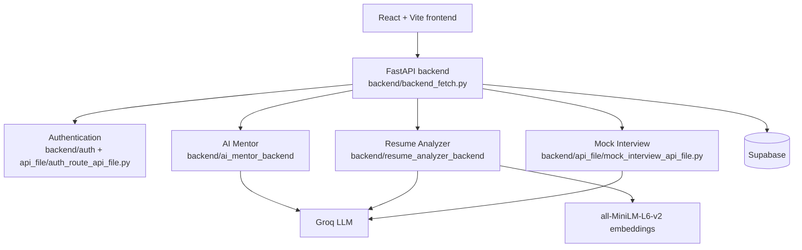

# Interview Prep

AI-powered interview preparation workspace with an AI mentor, resume intelligence, mock interviews, authentication, and progress-oriented frontend experiences.

<p align="center">
  
</p>

## Overview

Interview Prep helps candidates prepare for technical interviews in one place. The React frontend provides the workspace for Home, AI Mentor, Resume Analyzer, and Mock Interview flows. The FastAPI backend handles authentication, Supabase persistence, Groq-powered AI responses, PDF resume extraction, structured resume analysis, embeddings, and mock-interview scoring.

## Key Features

| Area | What it does |
| --- | --- |
| AI Mentor | Maintains chat sessions and provides personalized interview guidance using stored user context. |
| Resume Analyzer | Extracts a PDF resume, structures sections, scores resume quality, and optionally compares it to a job description. |
| Mock Interview | Generates interview questions, scores answers, supports skips/completion, and can transcribe audio answers. |
| Authentication | Supports local email/password auth, JWT access tokens, refresh tokens, password reset, and GitHub OAuth. |
| Home Workspace | Summarizes preparation progress and routes users toward the next useful action when data exists. |

## Architecture


```mermaid
flowchart TD
    Frontend["React + Vite frontend"] --> API["FastAPI backend<br/>backend/backend_fetch.py"]

    API --> Auth["Authentication<br/>backend/auth + api_file/auth_route_api_file.py"]
    API --> Mentor["AI Mentor<br/>backend/ai_mentor_backend"]
    API --> Resume["Resume Analyzer<br/>backend/resume_analyzer_backend"]
    API --> Mock["Mock Interview<br/>backend/api_file/mock_interview_api_file.py"]
    API --> DB[("Supabase")]

    Mentor --> Groq["Groq LLM"]
    Resume --> Groq
    Mock --> Groq
    Resume --> Embeddings["all-MiniLM-L6-v2 embeddings"]
```

LLM responses that feed application logic are parsed through Pydantic schemas, so downstream code receives validated structured data instead of arbitrary prose. The resume analyzer keeps both structured data and extracted source evidence available during scoring to reduce information loss.

## Tech Stack

| Layer | Tools |
| --- | --- |
| Frontend | React 19, Vite, Tailwind CSS, lucide-react, Recharts |
| Backend | FastAPI, Pydantic, LangChain output parsers |
| AI | Groq chat + Whisper transcription, optional LM Studio local client |
| Resume Processing | PyMuPDF, pymupdf4llm, sentence-transformers, scikit-learn |
| Data/Auth | Supabase, JWT, GitHub OAuth |
| Tests | pytest |

## Project Structure

```text
.
├── backend/
│   ├── ai/                         # Groq, transcription, and local model clients
│   ├── ai_mentor_backend/          # Mentor prompt flow, memory, web search helpers
│   ├── api_file/                   # Route-facing service functions
│   ├── auth/                       # JWT, password, and GitHub OAuth helpers
│   ├── resume_analyzer_backend/    # Resume extraction, parsing, scoring pipeline
│   ├── backend_fetch.py            # FastAPI application and route definitions
│   └── requirements.txt
├── Database/                       # Supabase schema and database helpers
├── interview-prep-app/             # React/Vite frontend
├── tests/                          # Focused backend tests
├── .env.example
└── README.md
```

## Resume Analyzer Pipeline

The analyzer has two modes.

### Resume Quality Mode

Used when no job description is supplied.

```text
PDF resume
→ markdown/text extraction with sanitized contact fields
→ section/header normalization
→ per-section Pydantic structuring
→ preserved source evidence + normalized structured text
→ resume quality analysis
→ Resume Score, overall review, section breakdown, strengths, gaps, and recommendations
```

The scoring prompt is instructed to use only resume evidence. It may suggest adding measurable results when the candidate has evidence for them, but it must not invent percentages, dates, technologies, achievements, or impact metrics.

### Job Match Mode

Used when a job description is supplied.

```text
Resume + JD
→ structured resume parsing
→ structured JD parsing
→ all-MiniLM-L6-v2 embeddings
→ cosine similarity as one signal
→ LLM role-fit comparison
→ backend blended overall score + match score, skills, gaps, and recommendations
```

The final JD score keeps semantic similarity separate from the LLM's match judgment. The backend computes:

```text
overall_score = round(0.4 * similarity_score * 100 + 0.6 * match_score)
```

Required JD skills are passed separately from responsibilities and qualifications so must-have gaps are weighted more clearly.

## AI Mentor Flow

The frontend sends mentor prompts to `/ai_mentor` with the user/session context. The backend retrieves prior summary and conversation context, gets a Groq response, stores messages, and updates the user's long-term preparation summary. Optional web search is routed through the existing mentor backend helpers when enabled.

## Authentication

Authentication lives in `backend/auth` and route-facing helpers in `backend/api_file/auth_route_api_file.py`.

- Local signup/login uses password hashing via `passlib`.
- Access tokens are JWTs signed with `JWT_SECRET`.
- Refresh/reset tokens are opaque random tokens stored as hashes.
- GitHub OAuth uses the authorization-code flow; the backend exchanges the code for a GitHub token so the client secret is never exposed to the frontend.

## Local Setup

### Prerequisites

- Python 3.11+
- Node.js 18+
- Supabase project URL and key
- Groq API key
- Optional: GitHub OAuth app for GitHub login
- Optional: Tavily key for mentor web search

### Environment Variables

Create a root `.env` from the example:

```bash
cp .env.example .env
```

Create a frontend env file:

```bash
cp interview-prep-app/.env.example interview-prep-app/.env
```

Fill in placeholders only. Do not commit real `.env` files.

### Run Backend

```bash
python -m venv .venv
source .venv/bin/activate
pip install -r backend/requirements.txt
uvicorn backend.backend_fetch:app --reload
```

FastAPI starts at `http://localhost:8000`.

### Run Frontend

```bash
cd interview-prep-app
npm install
npm run dev
```

Vite starts at `http://localhost:5173` by default.

### Run Tests

```bash
python -m pytest tests/test_resume_analyzer_core.py -q
```

## Important Endpoints

| Method | Endpoint | Purpose |
| --- | --- | --- |
| `POST` | `/auth/signup` | Create local account |
| `POST` | `/auth/login` | Login and receive tokens |
| `POST` | `/auth/github` | Complete GitHub OAuth login |
| `GET` | `/auth/me` | Return authenticated user |
| `POST` | `/ai_mentor` | Send a mentor chat message |
| `POST` | `/resume_analyzer` | Upload resume PDF and optional JD |
| `POST` | `/dashboard` | Return dashboard/home data |
| `POST` | `/mock_interview/start` | Start mock interview |
| `POST` | `/mock_interview/answer` | Score one mock answer |
| `POST` | `/mock_interview/complete` | Complete mock interview |
| `POST` | `/mock_interview/transcribe` | Transcribe an audio answer |

## Known Limitations

- PDF extraction still depends on the PDF's internal text structure; multi-column and text-box resumes can produce a different order than the visual layout.
- The resume analyzer now preserves source evidence for scoring, but truly image-only PDFs still require OCR support before they can be analyzed well.
- LLM JSON repair retries are intentionally limited to one retry to keep failures deterministic.
- There is no license file in the repository at the moment.

## Contributing

This is an active personal project. Keep changes focused, avoid committing secrets, and run the relevant frontend/backend validation before opening a PR.
